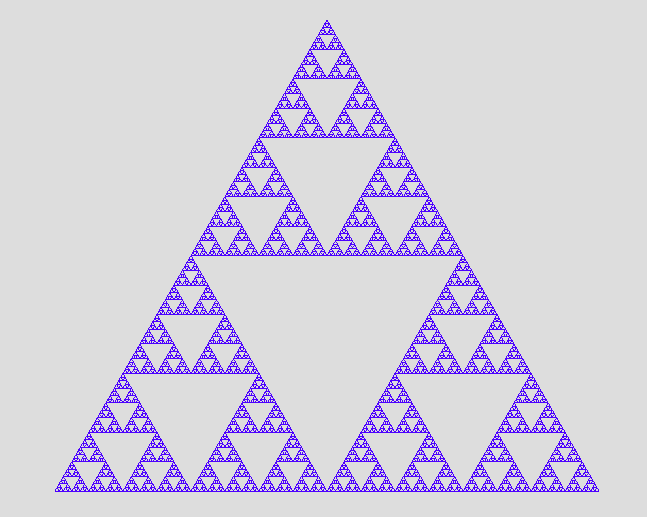

# Exercise 2: 2D Sierpinski Triangle

Link to starter code:
[link](https://github.com/hsharriman/3dprogramming-fractals/blob/main/exercises/ex2/sierpinski.html)

## Goal

Render a 2D sierpinski gasket using `three.js`. Here is an example of what your
finished product might look like:

## Instructions

Fill in the missing functions in the starter code provided in `sierpinski.html`.
You should be able to adjust the recursion depth of the gasket by adjusting one
variable and reloading the webpage. You will need to implement the `l`, `r`, and
`fwd` methods within the turtle graphics class as well to be able to
appropriately render your Sierpinski Gasket. If you have not encountered turtle
graphics before, check out the resources section below to learn about them!

## Resources

Check out these resources if you get stuck or need a place to start!  
[Wikipedia Sierpinski Triangle](https://en.wikipedia.org/wiki/Sierpi%C5%84ski_triangle)  
[Mathigon: Sierpinski](https://mathigon.org/course/fractals/sierpinski)  
[Sierpinski Triangle Using Turtle Graphics](https://stackoverflow.com/questions/25772750/sierpinski-triangle-recursion-using-turtle-graphics)  
[Beginner's Guide to the Python Turtle](https://realpython.com/beginners-guide-python-turtle/)
