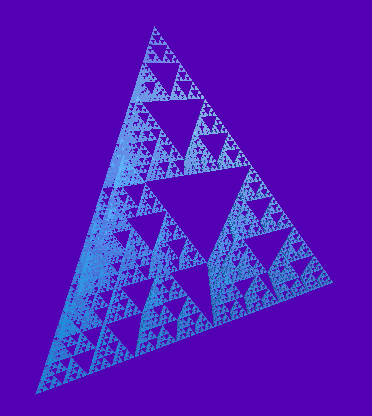

# Exercise 3: 3D Sierpinski Gasket
Link to starter code: [link](https://github.com/hsharriman/3dprogramming-fractals/tree/main/exercises/ex3)
### Goal



## Instructions

Create a 3D rendering of a Sierpinski Gasket using tetrahedrons and `three.js`.
There is a `THREE.TetrahedronGeometry` primitive, but you might prefer creating
your own tetrahedron by defining the faces yourself, as it simplifies the
orientation of the tetrahedrons relative to the global frame. The default
provided by `THREE` does not align with any of the `x,y,z` axis.

You will need to fill in the methods within the `TetrahedronGeometry` class to
be able to complete this exercise. Note that the 4 vertices in a unit
tetrahedron oriented normal to the positive z-axis are:

```
[
  new THREE.Vector3(0, 0, 0),
  new THREE.Vector3(1, 0, 0),
  new THREE.Vector3(0.5, Math.sqrt(3) / 2, 0),
  new THREE.Vector3(0.5, Math.sqrt(3) / 6, Math.sqrt(3) / 2),
];
```

These can be accessed within `TetrahedronGeometry` using `this.BASE_VERTICES`.

**Remember to `clone()` your instances of `THREE.Vector3` before performing any
transformations or adding them to a list!**

**Hint**: For your recursive step, think about how the vertices of each
tetrahedron line up with each other, and use their relationship to define your
gasket.

## Resources

Though I did initially look through a lot of resources for this exercise, all
the ones I found were more confusing than helpful (mostly dealing with other
tools, languages, or approaches), so I have elected not to list them here :)
