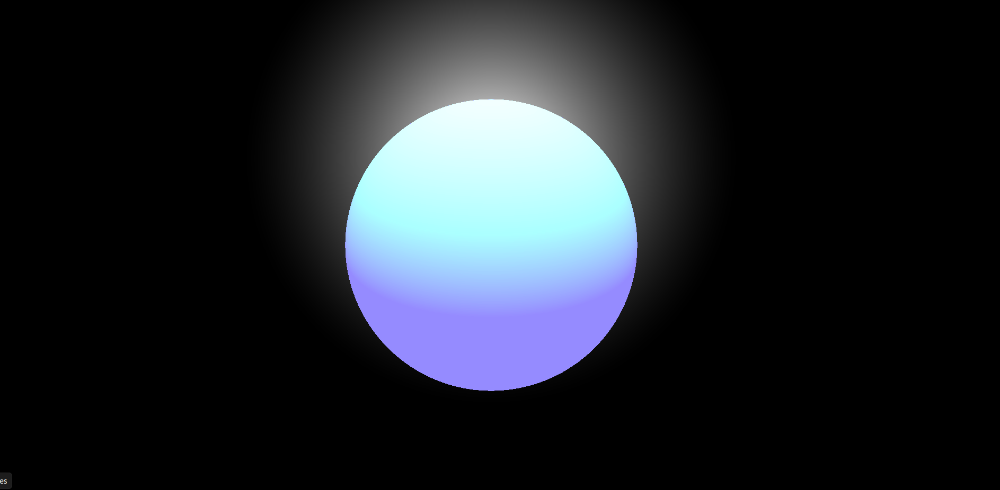

# Exercise 4: Introduction to Ray Marching

Link to starter code: [link](https://github.com/hsharriman/3dprogramming-fractals/tree/main/exercises/ex4)
## Goal

Fill in the starter code provided in `sphere.glsl` to render a blue sphere in
the middle of your canvas, like so:



## Instructions

### Starting a Local Server

You will need to spin up a local server in order for `three.js` to load the GLSL
file and render your sphere. You can start up a simple Python HTTP server by
running the following command from this directory:

```
python -m http.server
```

### Fill in Starter Code

You are provided with starter code split into two files. To implement ray
marching, you will use GLSL. GLSL is its own language, designed to be run on a
GPU. Unlike the previous exercises, where the specific object geometry and
lighting was defined by using only `three.js`, we will instead define the
objects and lighting within the scene using GLSL.

As such, `raymarching.html` is complete and should require no alterations by
you. You will be implementing functions within `sphere.glsl` instead. Check out
the resources section to help you along the way.

## Resources

[The Raymarching Algorithm](http://jamie-wong.com/2016/07/15/ray-marching-signed-distance-functions/#the-raymarching-algorithm)  
[Coding Adventure: Ray Marching](https://www.youtube.com/watch?v=Cp5WWtMoeKg)
This video is a great introduction to raymarching, note that his implementations
are made in Unity, but the concepts of the ray marching algorithm still apply.
